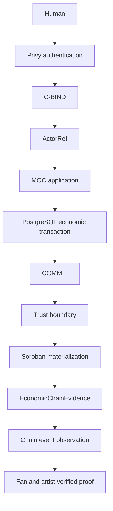

# Music On Chain

Music On Chain is a Web3 music platform that creates a direct, verifiable economic relationship between artists and fans.

Fans earn participation value and can use it to support music. Artists see attributable economic participation. Stellar and Soroban provide evidence that anyone can inspect. A real **Stellar Testnet** transaction is already public.

[Verified on Stellar Testnet](#verified-on-stellar-testnet) · [Try the certified proof](#try-the-certified-proof) · [Why Stellar](#why-stellar) · [How to verify](#quick-start) · [Español](#espanol)

## Try the certified proof

Hackathon release candidate: https://moc-hackathon-rc.vercel.app

Public Stellar proof, no login: https://moc-hackathon-rc.vercel.app/demo/stellar-proof

1. Open the landing page.
2. Choose **Abrir demo verificada** (English: **Explore verified demo**). It opens `/demo/stellar-proof`.
3. Fan support is $1.00 USDC. Artist participation is the same $1.00 USDC.
4. The artist state is accrued, not settled.
5. The network is Stellar Testnet. The protocol state shown is LOCKED.
6. Open the same transaction on Stellar Expert.

That $1 is 1,000,000 USDC-denominated minor units in the canonical PostgreSQL ledger. PostgreSQL does not hold USDC. Soroban records cryptographic evidence of the operation. The contract does not custody or transfer USDC, and accrued participation is not a completed settlement.

A judge only reads. The release candidate has no Stellar signing secrets and no Base executor. Trust execution is off. The settlement adapter is mock. The page shows persisted certified evidence.

---

## Problem

Independent artists work across fragmented tools. Fan participation rarely becomes a direct economic flow. Attributing that participation is hard to verify without trusting a single operator.

## Solution

Music On Chain connects artist, music, campaign, fan participation, reward, support, revenue, entitlement, and verifiable evidence in one product flow.

MOC records the economic support in USDC-denominated units in its canonical PostgreSQL ledger. Soroban independently commits and verifies cryptographic evidence of that operation. The Soroban contract does not custody or transfer the underlying USDC, and the support is not settled on Stellar.

## What we built

| Area | State |
| --- | --- |
| Artist Studio, including sales | Built |
| Fan participation, missions, and rewards | Built |
| Support a release with reward value | Built |
| Canonical economic record in PostgreSQL | Built |
| Soroban materialization after that record is committed | Built, Stellar Testnet |
| Separate artist, fan, and materializer authority | Built |
| Chain evidence and event observation | Built |
| The same verified proof for the fan and the artist | Built |
| Spanish and English product copy | Built |
| Stellar Mainnet, production settlement | Not in this submission |

## Why Stellar

PostgreSQL remains the economic ledger. Stellar does not replace it. Stellar adds a verifiable trust layer over a fact that MOC has already recorded.

That layer provides:

- an independent protocol authority, separate from the application database
- distinct signatures for the artist, the fan, and the materializer
- cryptographic commitments to the support, the revenue, the distribution, and the evidence
- public verifiability on Stellar Testnet
- deterministic, idempotent protocol state: the same payload replays, a different payload conflicts
- evidence a reviewer can open without trusting the MOC interface

The artist capability commits a reserve and authorizes a reward. The fan capability redeems that reward as support. The materializer closes the operation by locking the redemption. None of those three can sign the others' actions.

## Verified on Stellar Testnet

**TESTNET.** These identifiers are not Mainnet.

| Fact | Value |
| --- | --- |
| Contract | [`CDLQPK73RFCLHZ5FIT3W3UI3SW54PGTYXECFPXXISVFHCFSKZJ72UOYI`](https://stellar.expert/explorer/testnet/contract/CDLQPK73RFCLHZ5FIT3W3UI3SW54PGTYXECFPXXISVFHCFSKZJ72UOYI) |
| Lock transaction | [`fcb8bb94eec5be7e853c2db3d59a83dbca6a5c7e3c22079e2f33dba6fc3c2119`](https://stellar.expert/explorer/testnet/tx/fcb8bb94eec5be7e853c2db3d59a83dbca6a5c7e3c22079e2f33dba6fc3c2119) |
| Ledger | 5041383 |
| Materialization commitment | `a5c9d5a53c8f5e804d3a2e310438073e23a337ab77d557b498799b30506d50d9` |

The lock is `lock_redemption` on that contract. The same commitment is what the fan and the artist see in the product proof.

## Architecture



Authorities beside that boundary, not inside identity:

| Capability | Signs |
| --- | --- |
| Artist capability | `commit_reserve`, `authorize_reward` |
| Fan capability | `redeem` |
| Materializer | `lock_redemption` |

A Stellar account is a capability. It is not the ActorRef, and it is not how MOC decides who the fan or the artist is.

## Trust model

| Concern | Authority / source |
| --- | --- |
| Authentication | Privy |
| Identity | ActorRef |
| Binding | C-BIND |
| Economic truth | PostgreSQL |
| Protocol execution | Soroban on Stellar Testnet |
| Artist authority | Artist capability |
| Fan authority | Fan capability |
| Closure | Materializer |
| Proof | EconomicChainEvidence |
| Observation | ChainEventObservation. It records chain events and does not create revenue, a redemption, or an identity. |

Privy subject is not an ActorRef. An ActorRef is not a wallet. A wallet is not identity.

Canonical statement: [Stellar trust-native certification](docs/MOC-STELLAR-TRUST-NATIVE-CERTIFICATION.md). Identity binding: [C-BIND](docs/C-BIND.md).

## Demo flow

1. A fan completes a mission and receives a reward.
2. The fan supports a release with that value.
3. MOC commits the canonical economic record in PostgreSQL.
4. Only after that commit, Soroban materializes the evidence.
5. The fan sees a verified proof.
6. The artist sees the same proof beside accrued revenue. That accrued record is not a completed settlement.

| Stage | Where |
| --- | --- |
| Session | [`app/api/identity/session/route.ts`](app/api/identity/session/route.ts) |
| Support command | [`app/api/fan-economy/route.ts`](app/api/fan-economy/route.ts) |
| Economic commit | [`lib/fan-economy/service.ts`](lib/fan-economy/service.ts) (`redeemReward`) |
| Post-commit publication | [`lib/fan-economy/redeemApplication.ts`](lib/fan-economy/redeemApplication.ts) calls [`publishIfConfigured`](lib/fan-economy/materialization/publish.ts) |
| Soroban materialization | [`lib/fan-economy/materialization/service.ts`](lib/fan-economy/materialization/service.ts) |
| Fan proof | [`app/dashboard/support/page.tsx`](app/dashboard/support/page.tsx) |
| Artist proof | [`app/dashboard/sales/page.tsx`](app/dashboard/sales/page.tsx) |
| Public receipt | [Live proof](https://moc-hackathon-rc.vercel.app/demo/stellar-proof) and [`app/demo/stellar-proof/page.tsx`](app/demo/stellar-proof/page.tsx). Read-only projection of the certified operation. No login and no new transaction. |

## Soroban contract

The contract is an accounting commitment, not asset custody. Source: [`contracts/soroban/fan-economy-trust/src/lib.rs`](contracts/soroban/fan-economy-trust/src/lib.rs). Tests: [`contracts/soroban/fan-economy-trust/tests/protocol.rs`](contracts/soroban/fan-economy-trust/tests/protocol.rs).

A redemption is committed, then either locked or reversed. A locked redemption cannot be reversed. Replaying the same payload is idempotent. A conflicting payload is rejected. The materialization commitment is fixed when the materializer locks the redemption.

Canonical hashes live in [`lib/fan-economy/trust/canonical.ts`](lib/fan-economy/trust/canonical.ts). The browser does not supply them.

## Where to look

| Question | Path |
| --- | --- |
| Soroban contract | [`contracts/soroban/fan-economy-trust/src/lib.rs`](contracts/soroban/fan-economy-trust/src/lib.rs) |
| Fan economy | [`lib/fan-economy/service.ts`](lib/fan-economy/service.ts) |
| Post-commit materialization | [`lib/fan-economy/materialization/publish.ts`](lib/fan-economy/materialization/publish.ts) |
| Event reconciliation | [`lib/fan-economy/events/ingest.ts`](lib/fan-economy/events/ingest.ts) |
| Identity | [`docs/C-BIND.md`](docs/C-BIND.md) |
| Persistence | [`prisma/schema.prisma`](prisma/schema.prisma) |
| Proof UX | [`components/fan-economy/StellarProofCard.tsx`](components/fan-economy/StellarProofCard.tsx) |
| Proof read API | [`lib/fan-economy/materialization/proofCard.ts`](lib/fan-economy/materialization/proofCard.ts) |
| Application tests | [`lib/fan-economy/`](lib/fan-economy/) |
| Contract tests | [`contracts/soroban/fan-economy-trust/tests/protocol.rs`](contracts/soroban/fan-economy-trust/tests/protocol.rs) |

The documentation hub is [docs/README.md](docs/README.md). Start with the certification document above, not the historical backend notes.

## Quick start

Judge-safe validation does not need preproduction credentials, a production database, or Stellar signing keys.

```bash
npm install
npm test
npm run typecheck
npm run build
npm run test:e2e
cargo test --manifest-path contracts/soroban/fan-economy-trust/Cargo.toml
```

`npm test` forces a mock settlement adapter and does not send Base or Stellar transactions. `npm run test:e2e` runs the local EVM settlement checks. It does not exercise the fan-support proof and it does not use Base Mainnet.

### Local development

Copy [`.env.example`](.env.example) to a local env file and fill placeholders on your machine. Do not commit secrets. `npm run dev` needs a PostgreSQL database and a Privy app id before the signed-in product flow will open. Those are not required for the commands above.

Leave `MOC_TRUST_EXECUTION` unset or `off`. The proof can still be read when Testnet RPC settings are present. Writing evidence requires an explicit server switch and signing keys.

### Live Testnet materialization

Advanced. Requires server-side signing secrets. Not part of this quick start.

`scripts/s3-canonical-testnet-certification.ts` is **CERTIFICATION ONLY — MAY WRITE TO STELLAR TESTNET**. Do not run it to review the submission.

## Testing

Counts below are the certified baseline at `5bcfcfc`. This documentation change does not alter those suites.

| Command | What it proves | Certified count |
| --- | --- | --- |
| `npm test` | Application behavior, including the post-commit boundary, with settlement mocked | 255 |
| `cargo test --manifest-path contracts/soroban/fan-economy-trust/Cargo.toml` | Soroban authority, state transitions, and conflicts | 10 |
| `npm run test:e2e` | Local EVM settlement contract behavior on chain id 31337 | 18 |
| `npm run typecheck` | TypeScript program consistency | — |
| `npm run build` | Production Next.js build | — |

`npm test` excludes the Base contract, integration, fork, and live Sepolia files. Those live-network files are not part of judge-safe validation.

## Security

- Signing keys stay on the server. They are not `NEXT_PUBLIC_` values.
- The browser cannot choose the network, the contract, or the hashes.
- The browser cannot mark evidence as verified. The server derives that state.
- Stellar publication runs only after the PostgreSQL commit returns.
- If Stellar or RPC fails, the economic record remains.
- Stellar Mainnet is rejected. Base Mainnet is rejected.
- Testnet is an explicit configuration, not an implicit fallback.

## Known limitations

- The public proof is Stellar Testnet only.
- Some earlier supports have an economic record and no confirmed Stellar evidence. The product shows those as pending. They are not re-sent from this repository.
- Stellar publication stays off unless `MOC_TRUST_EXECUTION=soroban` is set on the server.
- The signed-in fan and artist flows require Privy.
- There is no production settlement in this submission.
- License: not yet specified.

## Team

Carlos Concha, Founder and CEO. Musician, sound technician, and music-industry operator, with artist relationships.

Pablo Guzmán, CTO. About 30 years in IT, focused on Web3 development and education since 2024.

## Visual walkthrough

This repository does not yet contain product screenshots. Do not treat missing images as missing evidence: the Testnet transaction above is the public proof. Captures still to be taken from the certified flow, without creating a new support:

1. Fan reward and support history.
2. Verified Stellar proof on the fan support page.
3. The same transaction open on Stellar Expert Testnet.
4. Artist sales with the same proof and attributable participation.
5. The architecture diagram in this README is the diagram. It does not need a screenshot.

<a id="espanol"></a>

## Español

Este documento de envío está en inglés. Music On Chain conecta a artistas y fans: el fan obtiene valor por participar y puede apoyar música; el artista ve un ingreso atribuible; Stellar Testnet permite inspeccionar la evidencia. La prueba pública, sin inicio de sesión, está en https://moc-hackathon-rc.vercel.app/demo/stellar-proof. El recorrido está en [Try the certified proof](#try-the-certified-proof).
