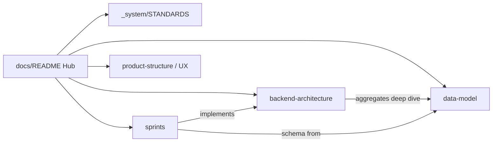

# Documentation Hub

| Field | Value |
|-------|-------|
| **Purpose** | Single entry point for the living documentation system. Every doc under `docs/` must be reachable from here. |
| **Dependencies** | [`_system/STANDARDS.md`](./_system/STANDARDS.md) |
| **Status** | Active |
| **Owner** | Documentation Steward |
| **Last Updated** | 2026-09-07 |
| **Related Documents** | [Standards](./_system/STANDARDS.md) · [Backend Architecture](./backend-architecture/README.md) · [Data Model](./data-model/README.md) · [Sprints](./sprints/README.md) · [C-BIND/1](./C-BIND.md) · [Root README](../README.md) · [Packages](../packages/README.md) |

---

## How to use this system

1. Read [Documentation Standards](./_system/STANDARDS.md) before adding or editing docs.  
2. Find the **canonical** area below — update there instead of creating orphans.  
3. Every change bumps **Last Updated** and keeps **Related Documents** accurate.

---

## Catalog

### System

| Document | Purpose |
|----------|---------|
| [_system/STANDARDS.md](./_system/STANDARDS.md) | Docs-as-code rules, metadata, anti-duplication |

### Architecture & data (production backend)

| Document | Purpose |
|----------|---------|
| [backend-architecture/README.md](./backend-architecture/README.md) | NestJS modular monolith, BCs, ADRs, infra |
| [data-model/README.md](./data-model/README.md) | Domain → PostgreSQL/Prisma canonical model |
| [sprints/README.md](./sprints/README.md) | Sprint index |
| [sprints/sprint-0.md](./sprints/sprint-0.md) | Infrastructure-only Sprint 0 |

### Product & UX (experience layer)

| Document | Purpose |
|----------|---------|
| [product-structure.md](./product-structure.md) | Product IA: Studio, Fan, Marketplace, About |
| [ux-audit.md](./ux-audit.md) | UX/copy audit notes |
| [vc-demo.md](./vc-demo.md) | Demo narrative for stakeholders |
| [ARTIST_PROFILE.md](./ARTIST_PROFILE.md) | Artist profile / channel (PoC + evolution) |
| [C-BIND.md](./C-BIND.md) | C-BIND/1 1.0.0 (CDR-008) consumption: Privy auth vs binding vs Actor |
| [UPLOAD_WIZARD.md](./UPLOAD_WIZARD.md) | Upload / release wizard notes |

### Domain features (PoC / evolving)

| Document | Purpose |
|----------|---------|
| [ticket-nft-system.md](./ticket-nft-system.md) | Tickets / events |
| [crowdfunding-contract-base.md](./crowdfunding-contract-base.md) | Crowdfunding on Base notes |
| [PR_CORE_SKELETON.md](./PR_CORE_SKELETON.md) | Core Protocol packages PR notes |

### Code packages

| Document | Purpose |
|----------|---------|
| [packages/README.md](../packages/README.md) | `@moc/*` Core Protocol packages |

---

## Canonical ownership (avoid duplicates)

---

## Adding a document

Same PR must:

1. Add/update the file with full metadata  
2. Register it in this catalog (or the folder README linked here)  
3. Link at least one **Related Document** back to a hub  

See [Standards — Before creating](./_system/STANDARDS.md#before-creating-a-new-document).
