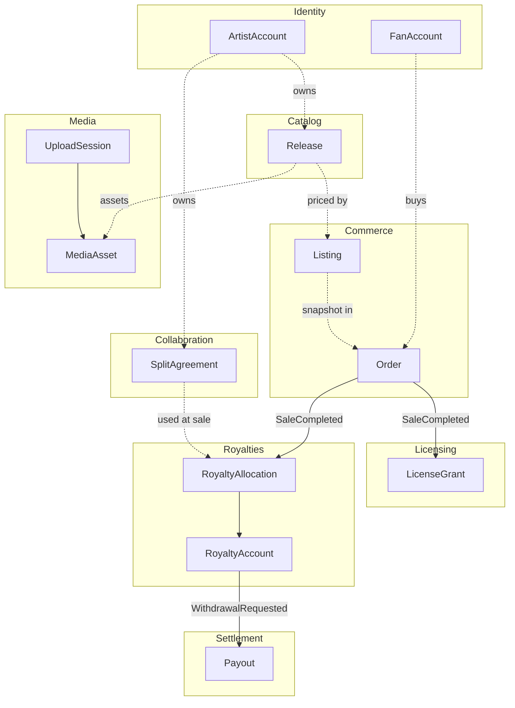
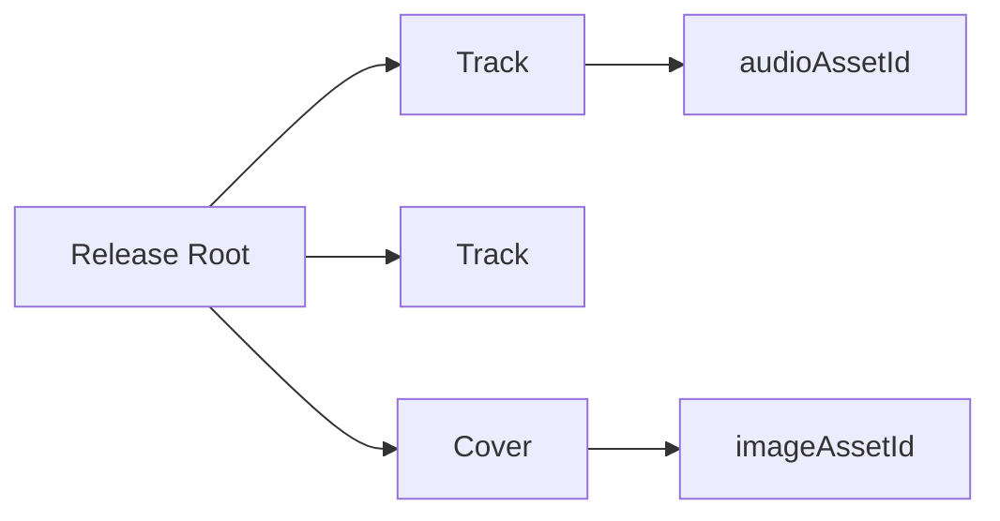
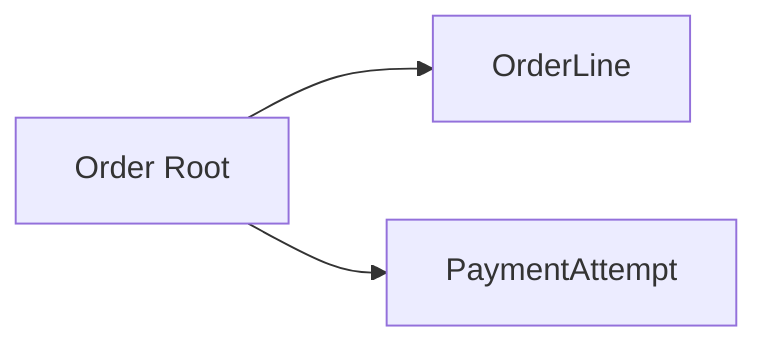
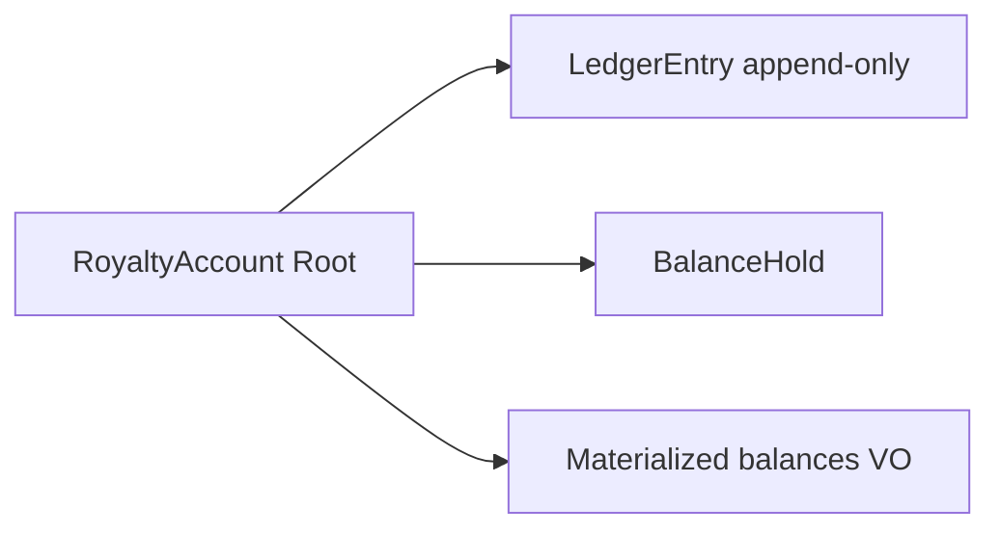
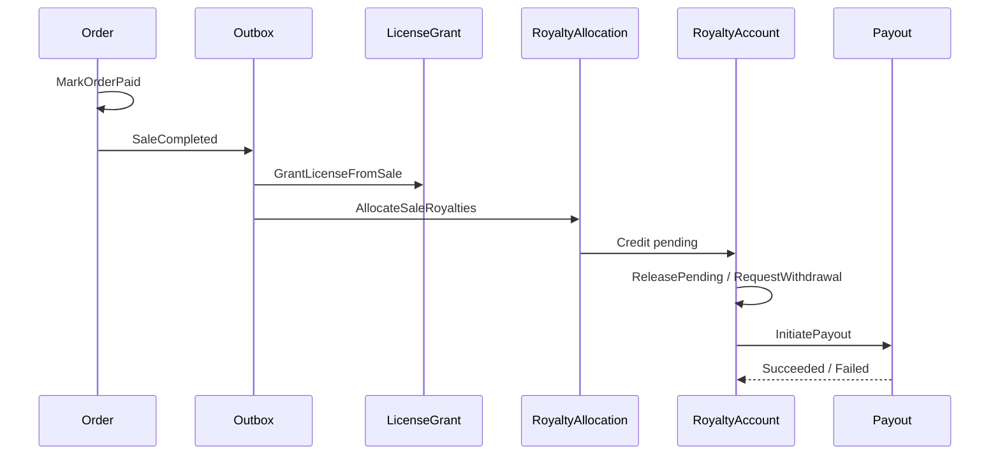

# Aggregate Diagram

| Field | Value |
|-------|-------|
| **Purpose** | Mermaid aggregate diagrams. |
| **Dependencies** | [Documentation Hub](../README.md) · [Standards](../_system/STANDARDS.md) · [Data Model README](./README.md) · [Architecture](../backend-architecture/README.md) |
| **Status** | Active |
| **Owner** | Data Architecture |
| **Last Updated** | 2026-07-23 |
| **Related Documents** | [Data Model README](./README.md) · [Architecture](../backend-architecture/README.md) · [Business Decisions](./15-business-decisions.md) · [Hub](../README.md) |

<!-- doc-id: data-model/09-aggregate-diagram.md -->

## Context map + aggregate roots

## Release aggregate (internal)

## Order aggregate (internal)

## RoyaltyAccount aggregate (internal)

## Sale flow across aggregates

