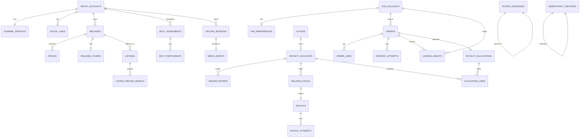

# ER Diagram (PostgreSQL logical)

| Field | Value |
|-------|-------|
| **Purpose** | Logical ER diagram for PostgreSQL. |
| **Dependencies** | [Documentation Hub](../README.md) · [Standards](../_system/STANDARDS.md) · [Data Model README](./README.md) · [Architecture](../backend-architecture/README.md) |
| **Status** | Active |
| **Owner** | Data Architecture |
| **Last Updated** | 2026-07-23 |
| **Related Documents** | [Data Model README](./README.md) · [Architecture](../backend-architecture/README.md) · [Business Decisions](./15-business-decisions.md) · [Hub](../README.md) |

<!-- doc-id: data-model/10-er-diagram.md -->

Logical ER for the canonical schema. Cross-BC links shown as dotted (ID-ref, no FK).

## Table list by schema

| Schema | Tables |
|--------|--------|
| `identity` | `artist_accounts`, `fan_accounts`, `channel_profiles`, `social_links`, `fan_preferences`, `auth_bindings` |
| `catalog` | `releases`, `tracks`, `release_covers` |
| `collaboration` | `split_agreements`, `split_participants` |
| `commerce` | `listings`, `listing_pricing_models`, `orders`, `order_lines`, `payment_attempts` |
| `licensing` | `license_grants` |
| `royalties` | `royalty_accounts`, `ledger_entries`, `balance_holds`, `royalty_allocations`, `allocation_lines`, `royalty_payment_timeline` |
| `settlement` | `payouts`, `payout_attempts` |
| `media` | `upload_sessions`, `media_assets` |
| `ops` | `outbox_messages`, `idempotency_records`, `domain_event_audit` |

## Note on ACTORS

There is no mandatory single `actors` table polymorphic root.  
**Business decision DM-09:** `artist_accounts` and `fan_accounts` are separate; `royalty_accounts.beneficiary_kind + beneficiary_id` references either. Collaborators who are not artists still get a `royalty_accounts` row keyed by participant/actor id issued at invite accept.
