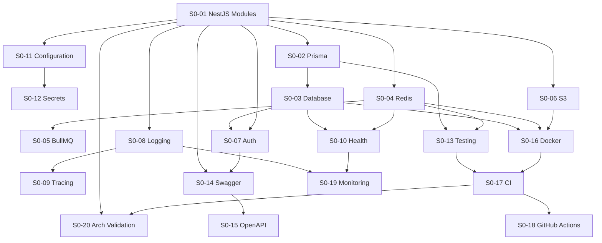

# Sprint 0 — Production Infrastructure

| Field | Value |
|-------|-------|
| **Purpose** | Sprint 0 — production infrastructure only (Nest, Prisma, Redis, BullMQ, S3, auth, observability, CI). No business features. |
| **Dependencies** | [Sprints Index](./README.md) · [Architecture](../backend-architecture/README.md) · [Data Model](../data-model/README.md) · [Standards](../_system/STANDARDS.md) · [Hub](../README.md) |
| **Status** | Active |
| **Owner** | Engineering / Delivery |
| **Last Updated** | 2026-07-23 |
| **Related Documents** | [Sprints Index](./README.md) · [Architecture](../backend-architecture/README.md) · [Data Model](../data-model/README.md) · [Hub](../README.md) · [ADR Index](../backend-architecture/adr/README.md) · [Standards](../_system/STANDARDS.md) |

<!-- doc-id: sprints/sprint-0.md -->

| Field | Value |
|-------|--------|
| **Sprint** | 0 |
| **Theme** | Platform foundation (no business features) |
| **Goal** | A deployable NestJS skeleton with data, queues, auth, observability, CI, and architecture gates — ready for Sprint 1 domain work |
| **Out of scope** | Catalog, Commerce, Royalties, Licensing, Studio/Fan product APIs, settlement business logic |
| **Aligned docs** | [`docs/backend-architecture`](../backend-architecture/README.md), [`docs/data-model`](../data-model/README.md) |
| **Suggested capacity** | ~2 engineers × 2 weeks ≈ **160 h** planned · **~148 h** estimated below (buffer for unknowns) |

---

## Sprint principles

1. **No business features** — no Release/Order/Royalty use cases beyond health stubs  
2. **Architecture first** — ESLint boundaries + CI must block illegal imports  
3. **Local = Staging parity** — Docker Compose for Postgres, Redis, MinIO (S3), mailhog optional  
4. **Secrets never in git** — `.env.example` only  
5. **Definition of Ready for Sprint 1** — `api` + `worker` boot, migrate, pass CI, expose `/health` + OpenAPI  

---

## Priority legend

| Priority | Meaning |
|----------|---------|
| **P0** | Sprint fails without it |
| **P1** | Required for production posture; can finish late in sprint |
| **P2** | Strongly preferred; spill to Sprint 0.5 only if blocked |

---

## Task index

| ID | Task | Priority | Hours | Depends on |
|----|------|----------|-------|------------|
| S0-01 | NestJS Modules | P0 | 12 | — |
| S0-02 | Prisma | P0 | 10 | S0-01 |
| S0-03 | Database | P0 | 8 | S0-02 |
| S0-04 | Redis | P0 | 6 | S0-01 |
| S0-05 | BullMQ | P0 | 10 | S0-04 |
| S0-06 | S3 | P0 | 8 | S0-01 |
| S0-07 | Authentication | P0 | 12 | S0-01, S0-03 |
| S0-08 | Logging | P0 | 6 | S0-01 |
| S0-09 | Tracing | P1 | 8 | S0-08 |
| S0-10 | Health Check | P0 | 4 | S0-03, S0-04 |
| S0-11 | Configuration | P0 | 6 | S0-01 |
| S0-12 | Secrets | P0 | 6 | S0-11 |
| S0-13 | Testing | P0 | 12 | S0-02, S0-04 |
| S0-14 | Swagger | P1 | 4 | S0-01, S0-07 |
| S0-15 | OpenAPI | P1 | 4 | S0-14 |
| S0-16 | Docker | P0 | 10 | S0-03, S0-04, S0-06 |
| S0-17 | CI | P0 | 6 | S0-13, S0-16 |
| S0-18 | GitHub Actions | P0 | 8 | S0-17 |
| S0-19 | Monitoring | P1 | 8 | S0-08, S0-10 |
| S0-20 | Architecture Validation | P0 | 10 | S0-01, S0-17 |

**Total estimated:** **148 hours**

---

## Dependency graph

---

## Tasks

### S0-01 — NestJS Modules

| | |
|--|--|
| **Priority** | P0 |
| **Estimated hours** | 12 |
| **Dependencies** | None |

**Scope**

- Scaffold `apps/api` and `apps/worker` (NestJS + TypeScript)  
- Create empty BC modules: Identity, Catalog, Collaboration, Commerce, Licensing, Royalties, Settlement, Media, Notification, Search, Admin, Platform, Infrastructure  
- Wire `AppModule` / `WorkerModule` composition roots only (no business controllers beyond placeholder)  
- Monorepo workspace path aliases for `@moc/*` packages  

**Acceptance Criteria**

- [ ] `apps/api` starts and listens on configured port  
- [ ] `apps/worker` starts without HTTP (or minimal internal only)  
- [ ] Each BC has a Nest `*.module.ts` file matching architecture module map  
- [ ] No domain business use cases implemented  
- [ ] README section documents how to run api vs worker  

**Definition of Done**

- Merged to main via PR  
- `pnpm`/`npm` scripts: `api:dev`, `worker:dev`  
- Typecheck passes for apps  

---

### S0-02 — Prisma

| | |
|--|--|
| **Priority** | P0 |
| **Estimated hours** | 10 |
| **Dependencies** | S0-01 |

**Scope**

- Adopt canonical multi-file schema from `docs/data-model/prisma` into `prisma/` (or `apps/api/prisma`)  
- PostgreSQL provider + multi-schema config  
- Prisma Client generation in Infrastructure module  
- **No** application repositories for business aggregates yet — only PrismaService provider  

**Acceptance Criteria**

- [ ] `prisma generate` succeeds  
- [ ] Schema files cover all BC schemas listed in data model (`identity`…`ops`)  
- [ ] Nest `PrismaService` injectable and connects in InfrastructureModule  
- [ ] SQLite PoC schema remains untouched / isolated from production Prisma path  

**Definition of Done**

- PR includes schema + generate script  
- Documented command: `prisma migrate` / `prisma generate`  
- Client import banned from `@moc/domain` (lint rule can land in S0-20)  

---

### S0-03 — Database

| | |
|--|--|
| **Priority** | P0 |
| **Estimated hours** | 8 |
| **Dependencies** | S0-02 |

**Scope**

- Postgres via Docker Compose for local  
- Baseline migration creating schemas + tables from Sprint 0 schema  
- App role credentials via env  
- Migration runs in CI against ephemeral Postgres  

**Acceptance Criteria**

- [ ] Fresh `docker compose up` yields reachable Postgres  
- [ ] `prisma migrate deploy` applies baseline cleanly on empty DB  
- [ ] Schemas `identity`, `catalog`, `collaboration`, `commerce`, `licensing`, `royalties`, `settlement`, `media`, `ops` exist  
- [ ] Connection pooling settings documented (Prisma pool size vs compose limits)  

**Definition of Done**

- Migration SQL committed  
- CI job proves migrate + generate  
- `.env.example` includes `DATABASE_URL`  

---

### S0-04 — Redis

| | |
|--|--|
| **Priority** | P0 |
| **Estimated hours** | 6 |
| **Dependencies** | S0-01 |

**Scope**

- Redis in Docker Compose  
- Nest Redis module / client wrapper implementing a minimal `CachePort` or infra helper  
- Separate logical DB index (or documented path) for cache vs future queues  

**Acceptance Criteria**

- [ ] Redis healthy in Compose  
- [ ] API can `PING` Redis on boot (or lazy connect with error surfacing in health)  
- [ ] Basic set/get smoke test in integration suite  
- [ ] `REDIS_URL` in `.env.example`  

**Definition of Done**

- Client lifecycle (connect/disconnect) hooked to Nest shutdown hooks  
- No business cache keys beyond `smoke:*`  

---

### S0-05 — BullMQ

| | |
|--|--|
| **Priority** | P0 |
| **Estimated hours** | 10 |
| **Dependencies** | S0-04 |

**Scope**

- BullMQ wired on Redis  
- Register **empty** named queues per architecture (`media.transcode`, `royalties.allocate`, `settlement.execute`, `notify.deliver`, `catalog.index`, `chain.index`, `settlement.reconcile`, `media.ipfs`)  
- Worker process consumes a **smoke** queue job (`platform.smoke`) only  
- Job failure retry defaults documented  

**Acceptance Criteria**

- [ ] API (or worker) can enqueue `platform.smoke`  
- [ ] Worker processes job successfully (no-op / log)  
- [ ] Failed job retry policy configured (attempts + backoff)  
- [ ] Queues named exactly as architecture doc (prefix allowed)  

**Definition of Done**

- Smoke e2e: enqueue → process within 30s in Compose  
- No royalty/commerce processors  

---

### S0-06 — S3

| | |
|--|--|
| **Priority** | P0 |
| **Estimated hours** | 8 |
| **Dependencies** | S0-01 |

**Scope**

- MinIO (S3-compatible) in Docker Compose  
- Infrastructure adapter: create bucket if missing, presign PUT/GET for smoke object  
- Config: endpoint, region, keys, bucket name  

**Acceptance Criteria**

- [ ] MinIO up via Compose  
- [ ] Smoke test uploads and downloads a small object via presigned URLs  
- [ ] Buckets/prefixes documented (`uploads/`, etc.) without business media pipeline  
- [ ] Credentials only via env  

**Definition of Done**

- Adapter behind port interface (e.g. `ObjectStoragePort`) stub  
- Integration test gated with Compose services  

---

### S0-07 — Authentication

| | |
|--|--|
| **Priority** | P0 |
| **Estimated hours** | 12 |
| **Dependencies** | S0-01, S0-03 |

**Scope**

- Auth middleware/guard for Nest: verify bearer token from configured provider (Privy JWT or configurable JWKS)  
- Map token → `authSubject`; **do not** implement full Artist/Fan registration business flows  
- `@Public()` decorator for health/docs/webhooks stubs  
- Reject unauthenticated `/v1/*` placeholder routes  

**Acceptance Criteria**

- [ ] Protected route returns `401` without token  
- [ ] Valid test JWT (or provider test token) yields `200` on stub `/v1/me` that returns subject only  
- [ ] Webhook path prefix `/internal/webhooks/*` is not user-JWT authenticated (signature placeholder OK)  
- [ ] Auth config via env (issuer, audience, JWKS URL)  

**Definition of Done**

- Security notes in README (no wallets as primary identity)  
- Unit tests for guard allow/deny  

---

### S0-08 — Logging

| | |
|--|--|
| **Priority** | P0 |
| **Estimated hours** | 6 |
| **Dependencies** | S0-01 |

**Scope**

- Structured JSON logging (pino / nestjs-pino or equivalent)  
- Request log: method, path, status, duration, `correlationId`  
- Redact Authorization headers and secrets  

**Acceptance Criteria**

- [ ] Logs are JSON in production profile  
- [ ] Each HTTP request includes `correlationId`  
- [ ] Secrets/tokens not logged  
- [ ] Log level configurable via env (`LOG_LEVEL`)  

**Definition of Done**

- Logger provider global  
- Example log line documented  

---

### S0-09 — Tracing

| | |
|--|--|
| **Priority** | P1 |
| **Estimated hours** | 8 |
| **Dependencies** | S0-08 |

**Scope**

- OpenTelemetry SDK for Nest API + worker  
- Export to console exporter locally; OTLP endpoint configurable for staging  
- Propagate `traceparent` / correlation with logs  

**Acceptance Criteria**

- [ ] Traces created for HTTP requests  
- [ ] Worker smoke job creates a span  
- [ ] `OTEL_EXPORTER_OTLP_ENDPOINT` optional; app boots if unset  
- [ ] Service name distinguishes `api` vs `worker`  

**Definition of Done**

- README: how to view traces locally  
- No vendor lock in domain packages  

---

### S0-10 — Health Check

| | |
|--|--|
| **Priority** | P0 |
| **Estimated hours** | 4 |
| **Dependencies** | S0-03, S0-04 |

**Scope**

- `GET /health/live` — process up  
- `GET /health/ready` — Postgres + Redis (+ optional S3/MinIO) checks  
- Used by Docker/K8s probes  

**Acceptance Criteria**

- [ ] Liveness returns `200` even if Redis briefly down  
- [ ] Readiness returns `503` if Postgres unreachable  
- [ ] Response body lists component statuses without secrets  
- [ ] Endpoints are `@Public()`  

**Definition of Done**

- Covered by e2e test  
- Compose healthcheck uses these endpoints for `api`  

---

### S0-11 — Configuration

| | |
|--|--|
| **Priority** | P0 |
| **Estimated hours** | 6 |
| **Dependencies** | S0-01 |

**Scope**

- Typed config module (`@nestjs/config` + zod/joi schema)  
- Fail fast on missing required env in `production`  
- Separate config namespaces: `app`, `db`, `redis`, `s3`, `auth`, `otel`  

**Acceptance Criteria**

- [ ] Invalid config prevents boot with clear error  
- [ ] `.env.example` lists all keys with comments  
- [ ] `NODE_ENV` switches validation strictness  
- [ ] No `process.env` scattered in BC modules (infra/config only)  

**Definition of Done**

- Unit test: schema rejects bad `DATABASE_URL`  
- Config documented in `/docs` or app README  

---

### S0-12 — Secrets

| | |
|--|--|
| **Priority** | P0 |
| **Estimated hours** | 6 |
| **Dependencies** | S0-11 |

**Scope**

- Secret handling policy + implementation hooks  
- Local: `.env` (gitignored)  
- CI: GitHub Actions secrets  
- Staging/prod: document mapping to secret manager (AWS SM / GCP SM / Doppler — choose one in doc; adapter stub OK)  
- Ensure Prisma/Redis/S3/Auth keys never committed  

**Acceptance Criteria**

- [ ] `.gitignore` covers `.env`, credential files  
- [ ] Secret scanning step in CI (gitleaks or GitHub secret scanning documented)  
- [ ] Runbook: rotating `DATABASE_URL`, Redis, S3, auth JWKS  
- [ ] No default production secrets in Compose override files committed  

**Definition of Done**

- `docs/sprints` or ops note linked from README  
- PR checklist item for secrets  

---

### S0-13 — Testing

| | |
|--|--|
| **Priority** | P0 |
| **Estimated hours** | 12 |
| **Dependencies** | S0-02, S0-04 |

**Scope**

- Vitest or Jest for unit tests  
- Supertest (or Nest testing) for API e2e  
- Testcontainers **or** Compose-based integration profile for Postgres/Redis  
- Coverage thresholds for `apps/api` infra only (reasonable floor, e.g. statements ≥ 60% on infra modules)  

**Acceptance Criteria**

- [ ] `npm test` / `npm run test:unit` passes offline for pure unit tests  
- [ ] `test:e2e` boots app against test DB and hits `/health/*`  
- [ ] Redis + Prisma smoke covered in integration job  
- [ ] Sample test proves Auth guard 401  

**Definition of Done**

- CI runs unit always; e2e on PR  
- Testing README with commands  

---

### S0-14 — Swagger

| | |
|--|--|
| **Priority** | P1 |
| **Estimated hours** | 4 |
| **Dependencies** | S0-01, S0-07 |

**Scope**

- `@nestjs/swagger` setup  
- UI at `/docs` (non-production disable flag supported)  
- Bearer auth scheme documented  

**Acceptance Criteria**

- [ ] Swagger UI loads locally  
- [ ] Health + stub `/v1/me` appear  
- [ ] Can be disabled with `SWAGGER_ENABLED=false`  
- [ ] No business resource schemas beyond stubs  

**Definition of Done**

- Linked from developer README  

---

### S0-15 — OpenAPI

| | |
|--|--|
| **Priority** | P1 |
| **Estimated hours** | 4 |
| **Dependencies** | S0-14 |

**Scope**

- Export OpenAPI 3 JSON/YAML artifact in CI (`openapi.json`)  
- Version field `1.0.0-sprint0`  
- Contract smoke: file committed or published as CI artifact  

**Acceptance Criteria**

- [ ] `npm run openapi:export` generates valid OpenAPI 3 document  
- [ ] CI uploads artifact on main/PR  
- [ ] Breaking-change policy stub references ADR-012  

**Definition of Done**

- Artifact path documented  
- Optional spectral/lint gate (warn-level OK in Sprint 0)  

---

### S0-16 — Docker

| | |
|--|--|
| **Priority** | P0 |
| **Estimated hours** | 10 |
| **Dependencies** | S0-03, S0-04, S0-06 |

**Scope**

- `Dockerfile` for `api` and `worker` (multi-stage, non-root user)  
- `docker-compose.yml`: api, worker, postgres, redis, minio, (optional otel collector)  
- `.dockerignore`  
- Compose profiles: `dev` vs `ci`  

**Acceptance Criteria**

- [ ] `docker compose up --build` brings stack healthy  
- [ ] API readiness green  
- [ ] Worker processes smoke job  
- [ ] Images do not contain `.env` secrets  
- [ ] Multi-stage final image excludes devDependencies  

**Definition of Done**

- Documented ports and volumes  
- Compose used by CI e2e where applicable  

---

### S0-17 — CI

| | |
|--|--|
| **Priority** | P0 |
| **Estimated hours** | 6 |
| **Dependencies** | S0-13, S0-16 |

**Scope**

- Pipeline stages: install → lint → typecheck → unit → build → e2e (compose) → openapi export  
- Cache dependencies  
- Fail on lint/typeerror  

**Acceptance Criteria**

- [ ] PR cannot merge red (branch protection recommended)  
- [ ] E2E uses ephemeral Postgres/Redis  
- [ ] Build produces api + worker artifacts/images  
- [ ] Duration target documented (< 20 min best effort)  

**Definition of Done**

- Pipeline definition reviewed in PR  
- Badge or status check name listed in README  

---

### S0-18 — GitHub Actions

| | |
|--|--|
| **Priority** | P0 |
| **Estimated hours** | 8 |
| **Dependencies** | S0-17 |

**Scope**

- Implement CI as GitHub Actions workflows  
- Workflows: `ci.yml` (PR + main), `docker-publish.yml` (optional, main only), `codeql` or secret scan  
- Required secrets documented in repo Settings checklist  
- Concurrency group cancel-in-progress on PR  

**Acceptance Criteria**

- [ ] `.github/workflows/ci.yml` exists and passes on PR  
- [ ] Actions use pinned action versions (SHA or tagged immutable policy)  
- [ ] OIDC/permissions least privilege (`contents: read` default)  
- [ ] Failed job logs enough to debug without secrets  

**Definition of Done**

- Branch protection doc: require `ci` check  
- CODEOWNERS optional for `/apps/api` `/prisma`  

---

### S0-19 — Monitoring

| | |
|--|--|
| **Priority** | P1 |
| **Estimated hours** | 8 |
| **Dependencies** | S0-08, S0-10 |

**Scope**

- Metrics endpoint or exporter: Prometheus `/metrics` (default Nest/prom-client)  
- Golden signals: request rate, error rate, latency histogram, Node process metrics  
- Alert rule **examples** (markdown): API readiness down, Postgres down, queue failed jobs > N  
- No full vendor APM purchase required — hooks only  

**Acceptance Criteria**

- [ ] `/metrics` scrapeable locally  
- [ ] HTTP latency histogram present  
- [ ] Worker exports at least job processed/failed counters for smoke queue  
- [ ] Runbook stub: “what to check when ready=503”  

**Definition of Done**

- Metrics flagged `@Public()` or internal-network only (documented)  
- Dashboard JSON optional (P2 stretch)  

---

### S0-20 — Architecture Validation

| | |
|--|--|
| **Priority** | P0 |
| **Estimated hours** | 10 |
| **Dependencies** | S0-01, S0-17 |

**Scope**

- ESLint `no-restricted-imports` / boundaries: domain cannot import Nest, Prisma, Redis, S3 SDKs  
- CI job `arch:check` fails on violations  
- Optional dependency-cruiser or Nx tags  
- Validate folder layout matches `docs/backend-architecture/06-folder-structure.md` (checklist script)  
- ADR/data-model index link check (files exist)  

**Acceptance Criteria**

- [ ] Deliberate illegal import in a CI test fixture fails the gate (then removed) or unit test of config  
- [ ] `@moc/domain` has zero Nest/Prisma dependencies in package.json  
- [ ] Script documents allowed dependency direction  
- [ ] PR template checkbox: “Architecture boundaries respected”  

**Definition of Done**

- `arch:check` required in GitHub Actions  
- Short `/docs/backend-architecture` note pointing to the gate  

---

## Sprint 0 Definition of Done (whole sprint)

Sprint 0 is **done** when all of the following are true:

1. All **P0** tasks meet their task-level DoD  
2. `docker compose up` yields healthy **api** + **worker** + dependencies  
3. CI (GitHub Actions) is green on main  
4. OpenAPI stub artifact publishes  
5. Architecture validation gate is enforced (`arch:check` + `npm run docs:validate`)  
6. No business feature endpoints beyond auth stub `/v1/me` and health/docs/metrics  
7. Sprint report (short) lists leftover **P1** carry-over if any  
8. Sprint listed in [Documentation Hub](../README.md) with current metadata ([Standards](../_system/STANDARDS.md))  

---

## Explicit non-goals (reject in PR review)

- Release wizard / royalty engine APIs  
- Circle / Alchemy production integration (stubs/config keys only if needed for config schema — **no live calls required**)  
- Migrating Next.js SQLite data  
- Solidity / contracts work  
- UI changes  

---

## Carry-over policy

- **P0** incomplete → Sprint 0 not closed; extend, do not start Sprint 1 domain  
- **P1** incomplete → allowed as Sprint 0.1 hotfix parallel to Sprint 1 kickoff only if Health, CI, DB, Auth, Arch gates are green  

---

## Suggested board columns

`Backlog → In progress → Review → Blocked → Done`

---

## Kickoff checklist

- [ ] Assign owners per S0-XX  
- [ ] Create GitHub milestone `sprint-0`  
- [ ] Create issues from each task ID  
- [ ] Confirm Docker resources available for CI runners  
- [ ] Confirm auth provider test tenant / JWKS for staging  

---

## Exit criteria → Sprint 1 readiness

Sprint 1 may start when:

| Gate | Evidence |
|------|----------|
| Platform boots | Compose healthy |
| Data layer | Migrate deploy OK |
| Async | Smoke BullMQ job OK |
| Security baseline | Auth guard + secrets policy |
| Quality | CI green + arch gate |
| Contracts | OpenAPI exported |
| Observability | Logs + health (+ metrics/traces best effort) |
